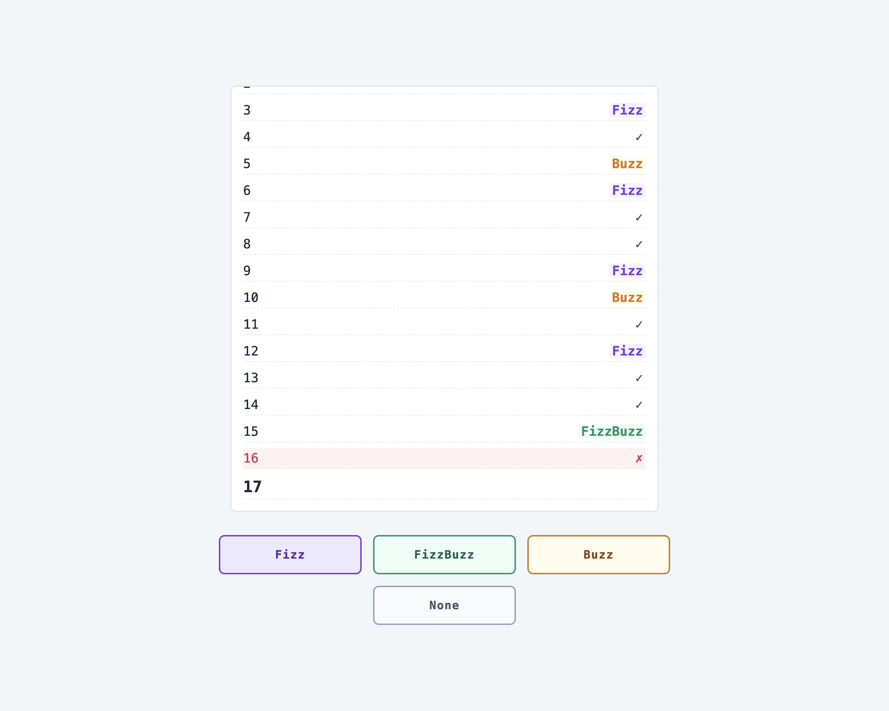
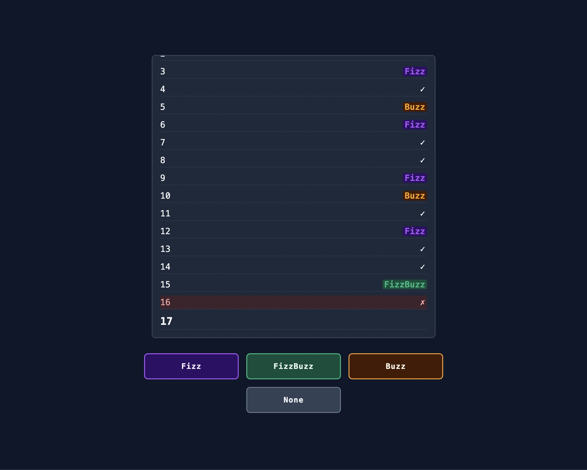

# FizzBuzz Game

This is a playable, terminal-style game of FizzBuzz! 

--- 

## Rules of the Game 
* **Fizz** for numbers divisible by 3. 
* **Buzz** for numbers divisible by 5. 
* **FizzBuzz** for numbers divisible by both 3 and 5. 
* **None** for numbers divisible by 3 or 5. 

--- 

## Visual Demonstation

| Light Mode | Dark Mode | 
| :--- | :--- |
|  |  |

> **Note:** This game automatically detects your system's theme settings and switches between Light and Dark mode instantly. 

---

## Features 

* **Interactive Gameplay** 
* **Theme Synchronization:** Uses the `prefers-color-scheme` media query. 
* **Dynamid UI:** Auto-scolling "terminal" output with smooth animations. 
* **Responsive Design:** Playable on mobile, tablet, and desktop. 
* **Visual Feedback:** Unique color-coding + shake animations for wrong answers. 

--- 

## Getting Started 

1. **Clone the repository**
2. **Open the project:**
    -> open the `index.html` in any modern web browser. 